# Step 6 shared-surface sketch-fidelity review

Date: 2026-08-19
Status: implementation evidence for V3 Design master review; this document does not accept Step 6.

## Scope and method

This review compares the live V3 dashboard shared surfaces with the accepted Sketch 003 visual-language winner, using Sketches 009, 010, 017, and 019 only for their declared shared boundaries. It covers the three native style/signature pairs in Light and Dark, the complete 15-profile outer-paint matrix, and ultra-wide side-background continuity.

Reference and production screenshots use equal 1440 x 1080 crops at the top of the dashboard. The reference was selected in the Sketch 003 review UI at a 1920 x 1080 browser viewport and captured from `.product-viewport`. Production was selected through the live Dashboard look preview in a fresh context and captured at 1440 x 1080 after the non-persistent drawer layer was hidden. No `Set` action was invoked and no dashboard or browser preference was persisted. Ultra-wide production screenshots use the full 1920 x 1080 and 2560 x 1440 viewports.

The accepted sketch uses demonstration data and panel topology, while production uses the canonical V3 dashboard bundle. Data, chart type, panel count, and mock-only review fixtures are therefore excluded from fidelity scoring. The comparison is intentionally about shared paint, border, radius, elevation, typography, section framing, and outer-canvas behavior.

## Matched visual comparisons

### Evidence Ledger / Brighter Vellum

| Light reference | Light production |
| --- | --- |
| 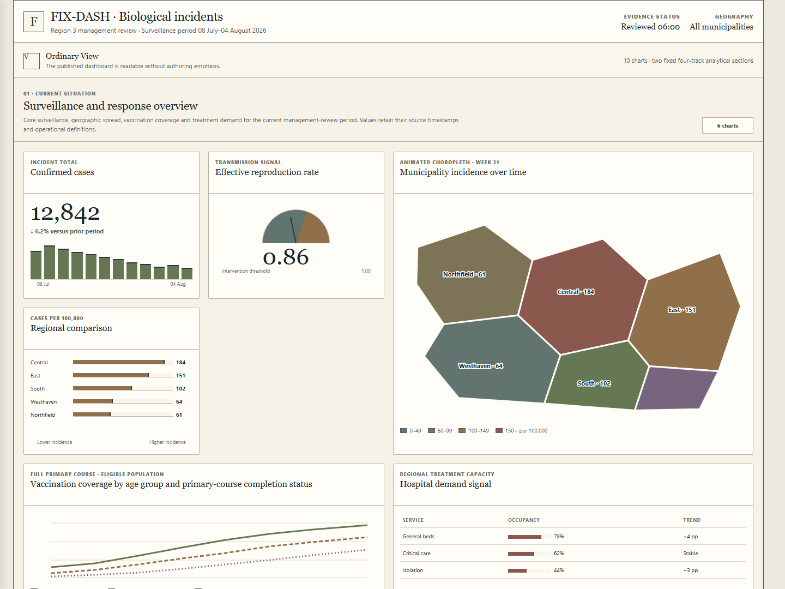 | 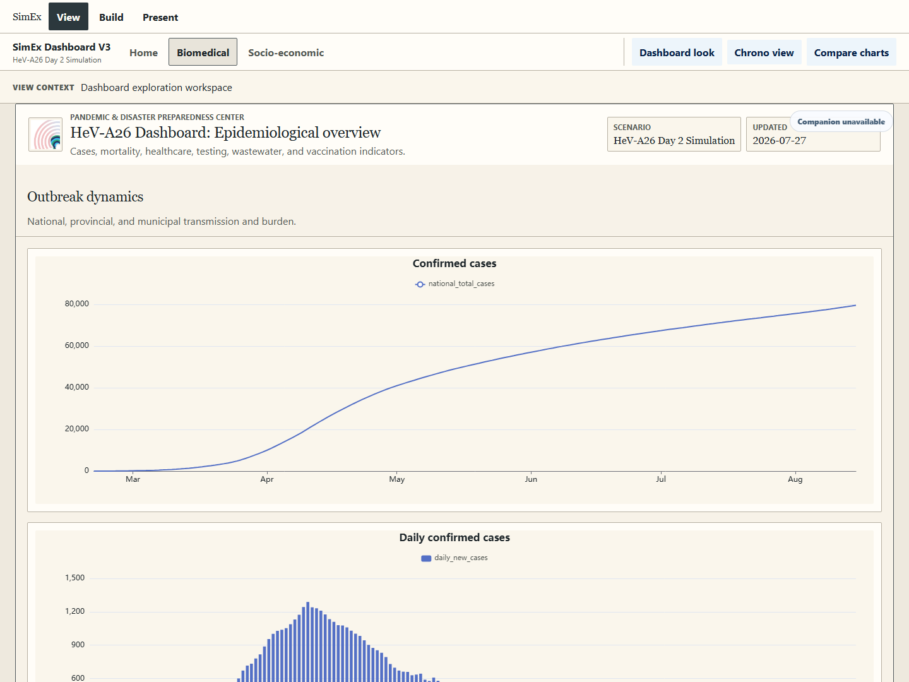 |

| Dark reference | Dark production |
| --- | --- |
| 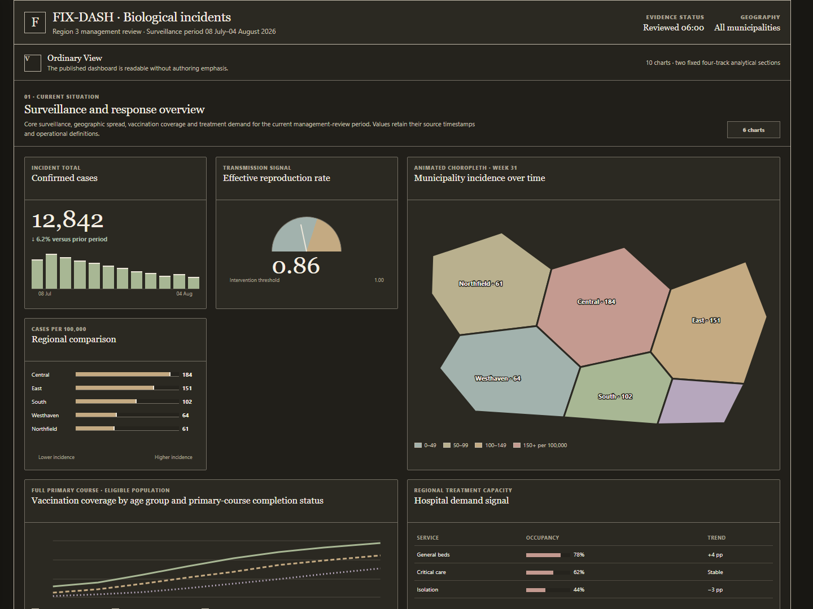 | 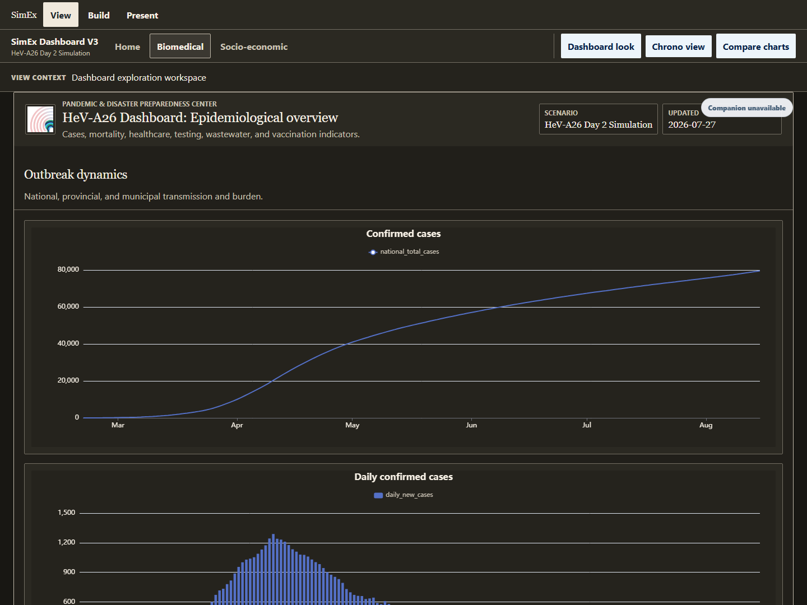 |

The live result now reads as the accepted ruled editorial surface: warm vellum outer/canvas separation, crisp borders, 2px panels and controls, serif hierarchy, and no elevation. The reference demo wrapper computes square while the accepted shared style token is 2px; production follows the accepted token and the visual difference is not material at the captured scale.

### Humanist Standard / Common Ground

| Light reference | Light production |
| --- | --- |
| 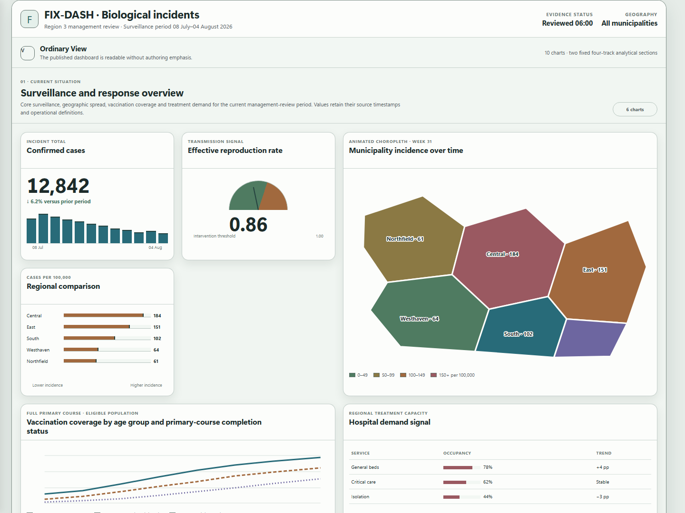 | 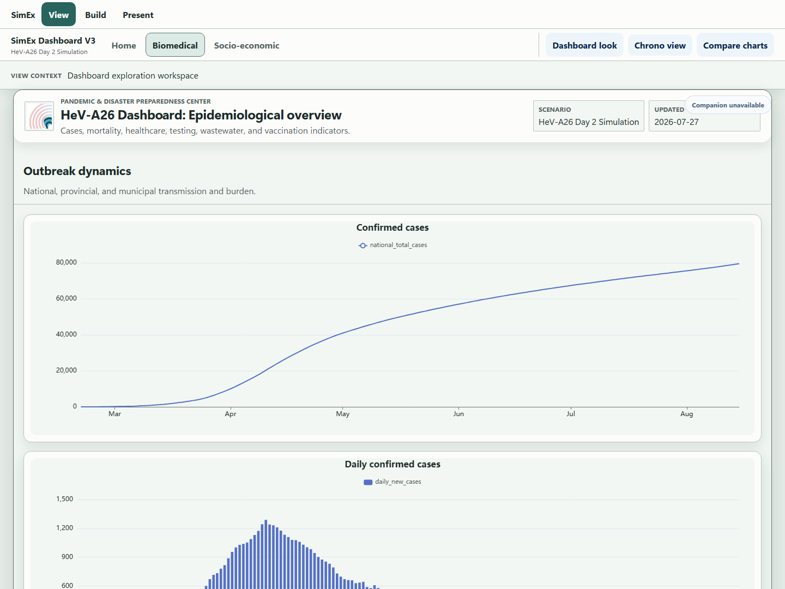 |

| Dark reference | Dark production |
| --- | --- |
| 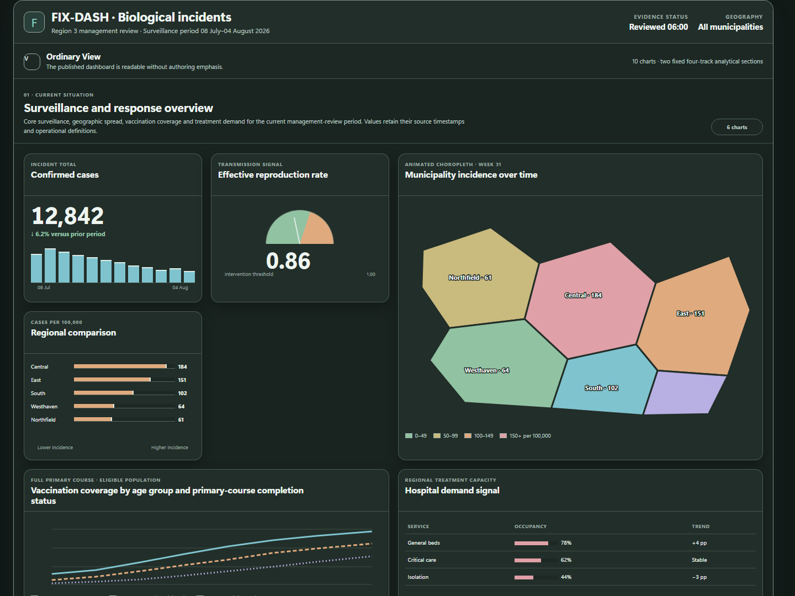 | 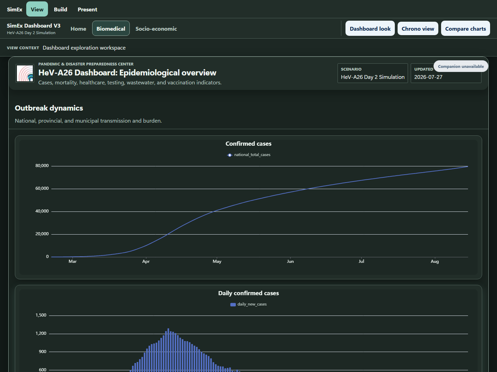 |

The live result now carries the accepted soft grammar instead of the former generic shape: 18px shell, 14px panels, 10px controls, quiet green surface layering, and visible low-amplitude elevation in both appearances.

### Signal + Instrument / Calibrated Steel

| Light reference | Light production |
| --- | --- |
| 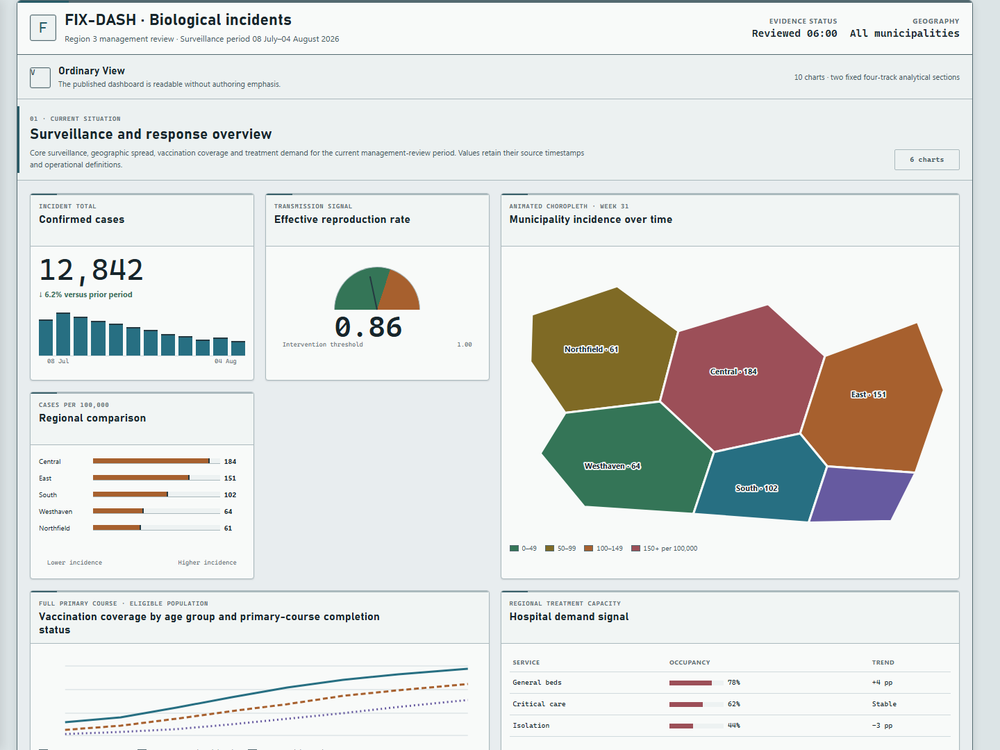 | 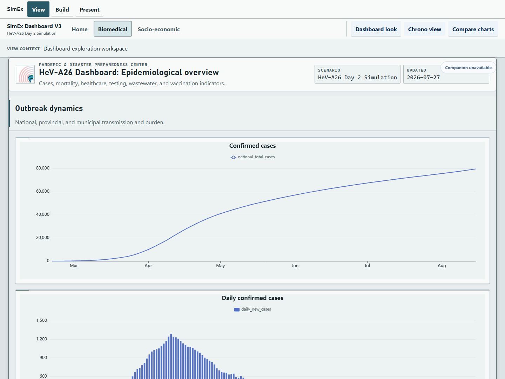 |

| Dark reference | Dark production |
| --- | --- |
| 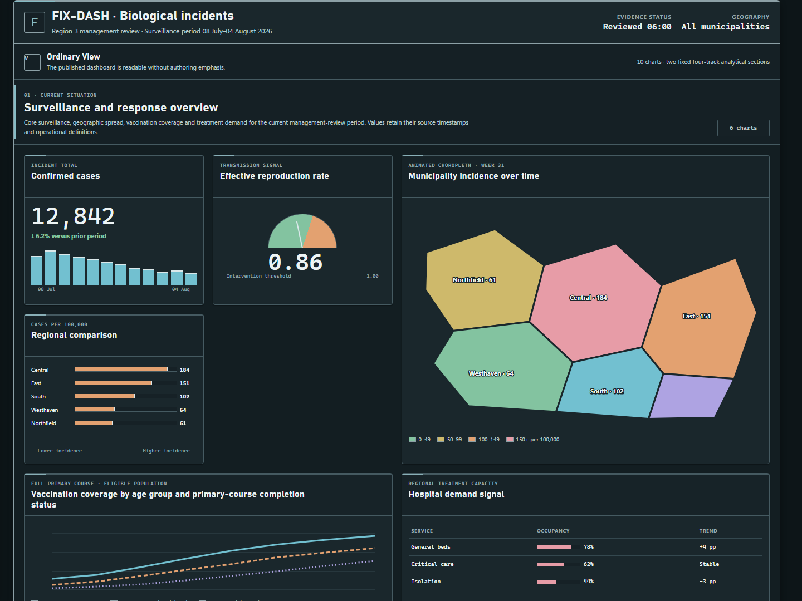 | 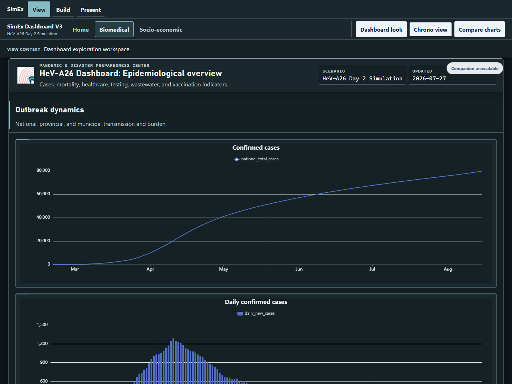 |

The live result now carries the accepted technical grammar: 6px shell, 4px panels, 3px controls, compact inset elevation, 3px section accent, mono data treatment, and low-glare plot surfaces. Legacy packaged white chart backgrounds now yield to the selected profile. Renderer-owned title and legend defaults inherit the profile text colors, while explicitly authored non-white backgrounds and explicit text colors remain intact.

## Measured shared-surface comparison

Measurements are recorded in [screenshots/measurements.json](screenshots/measurements.json). Values below are computed browser results, not estimates.

| Contract | Accepted/reference | Production | Result |
| --- | --- | --- | --- |
| Dashboard maximum width | 1392px contract | 1392px | Match |
| Section header padding | `22px 18px 14px` | `22px 18px 14px` | Match |
| Section bottom rule | 1px solid profile subtle border | 1px solid profile subtle border | Match |
| Section/title band to first panel border | 18px | 18px in all six native captures | Match |
| Grid/stage inset | 18px stage | 18px | Match |
| Panel gap | 16px | 16px | Match |
| Panel internal padding | 12px plot frame contract | 12px | Match |
| Evidence panel radius / shadow | 2px / none | 2px / none | Match |
| Humanist shell / panel / control radius | 18px / 14px / 10px | 18px / 14px / 10px | Match |
| Humanist panel shadow, Light | `0 8px 20px rgb(36 57 52 / 10%)` | Same computed shadow | Match |
| Humanist panel shadow, Dark | `0 10px 24px rgb(0 0 0 / 24%)` | Same computed shadow | Match |
| Signal shell / panel / control radius | 6px / 4px / 3px | 6px / 4px / 3px | Match |
| Signal panel shadow, Light | technical outer + inset edge | `0 1px 2px rgb(19 38 45 / 14%)`, inset highlight | Match |
| Signal panel shadow, Dark | technical outer + inset edge | `0 1px 2px rgb(0 0 0 / 38%)`, inset highlight | Match |
| Signal section signature | 3px accent rule | 3px accent rule | Match |

The production panel widths and row heights differ from the sketch fixture because they render the canonical V3 configuration. Those content-layout differences were not used to alter View/Build geometry and are outside this shared-foundation correction.

## All 15 profile paint evidence

The browser contract selected every profile in both Light and Dark and asserted both the live profile attribute and the actual `.app-frame` outer background. All 30 combinations passed.

| Profile | Light outer | Dark outer |
| --- | --- | --- |
| Evidence Ledger / Brighter Vellum | `#eee9de` | `#181713` |
| Evidence Ledger / Ash Register | `#deded9` | `#151615` |
| Evidence Ledger / Cool Archive | `#dfe3e1` | `#141817` |
| Humanist Standard / Common Ground | `#e6ece8` | `#121a18` |
| Humanist Standard / Quiet Commons | `#e9e9e5` | `#171918` |
| Humanist Standard / Open Forum | `#e8e6ed` | `#17151c` |
| Signal + Instrument / Calibrated Steel | `#dce4e6` | `#0d1518` |
| Signal + Instrument / Quiet Telemetry | `#e1e5e6` | `#111719` |
| Signal + Instrument / Amber Vector | `#e2e3e5` | `#151314` |
| Portfolio utility / Prismatic Index | `#e2e2e7` | `#111117` |
| Portfolio utility / Chromatic Polarity | `#ddd5cb` | `#161319` |
| Portfolio utility / Luminance Ladder | `#ded8e7` | `#150d1b` |
| GraphPad / Sunrise Reference | `#e8ddd2` | `#160f14` |
| GraphPad / Lakeside Reference | `#dde4e3` | `#0e1515` |
| Portfolio utility / Monochrome Reserve | `#d6d6d6` | `#0d0d0d` |

## Ultra-wide side-background continuity

The full-width `.app-frame` now owns the profile outer paint; the centered canonical frame remains exactly 1392px. The side background therefore continues to both browser edges instead of ending at the previous fixed cold-blue body color.

| Native profile / appearance | 1920 x 1080 sides | 2560 x 1440 sides | Actual outer paint |
| --- | ---: | ---: | --- |
| Brighter Vellum Light | 264px / 264px | 584px / 584px | `rgb(238, 233, 222)` |
| Brighter Vellum Dark | 264px / 264px | 584px / 584px | `rgb(24, 23, 19)` |
| Common Ground Light | 264px / 264px | 584px / 584px | `rgb(230, 236, 232)` |
| Common Ground Dark | 264px / 264px | 584px / 584px | `rgb(18, 26, 24)` |
| Calibrated Steel Light | 264px / 264px | 584px / 584px | `rgb(220, 228, 230)` |
| Calibrated Steel Dark | 264px / 264px | 584px / 584px | `rgb(13, 21, 24)` |

The twelve full-viewport screenshots are stored as `screenshots/<style>-<appearance>-1920x1080.png` and `screenshots/<style>-<appearance>-2560x1440.png`. Visual inspection confirmed continuous paint above, beside, and below the centered frame; no random cutoff or fixed-color side strip remains.

## Material corrections made

- Mapped shared shells, panels, controls, and elevation to the native style grammar instead of generic component radii.
- Restored the Sketch 003 section frame: exact header padding, border rules, 18px panel inset, 16px grid gap, and 12px panel/plot padding.
- Set the canonical shared frame to the accepted 1392px maximum while keeping it centered and preserving View/Build parity.
- Made the full-width app and Audience root consume the selected outer paint; mapped Audience display and cells to shared canvas/panel tokens.
- Added Evidence, Humanist, and Signal section-surface signatures without introducing authoring or audience workflow behavior.
- Let packaged legacy white chart backgrounds yield to profile plot surfaces while preserving explicit non-white authored backgrounds.
- Projected profile text defaults into ECharts titles and legends so dark plots remain readable; explicit authored colors still win.

## Verification evidence

- TDD browser RED initially exposed generic radius/shadow, transparent outer paint, the 1500px frame, and fixed side gutters.
- A visual RED then exposed the shell box-model and section-header paint mismatch before the final mapping.
- A later browser RED measured Signal Dark plot paint as `rgb(255, 255, 255)` instead of `rgb(22, 33, 38)`.
- The final visual pass exposed low-contrast renderer-owned navy labels on the accepted dark plot surface; the focused unit RED captured the missing projected title/legend defaults.
- `node --test tests/chartRenderingV3.test.js`: 44 passed.
- `pnpm exec playwright test tests/e2e/v3-style-fidelity.spec.js --project=chromium`: 4 passed. This includes native style signatures, dark chart surface behavior, all 30 profile/appearance paint combinations, and 12 ultra-wide continuity measurements.
- `pnpm build`: passed (768 modules transformed). Vite reported its existing large-chunk advisory only.

## Boundaries and limitations

- View and Build continue to consume the same canonical page frame; no mode-specific geometry fork was introduced.
- Capture contexts used preview-only appearance/style/profile state and did not persist changes.
- Step 7 authoring workflows and Step 8 Present/Audience features were not implemented. Only already-shared Audience paint drift was corrected.
- Sketch demonstration charts, mock review rails, badges, fake metrics, and rejected alternatives are not production requirements and were excluded.
- The screenshot crop documents the top shared surfaces at readable scale; the ultra-wide captures supplement it specifically for the full browser-side behavior.

## Review conclusion

The material shared-surface differences found in the baseline review are corrected. The three native styles are now visibly distinct in borders, corners, elevation, section treatment, type, and profile paint; Light and Dark plot surfaces remain readable; the exact 18px section-to-panel spacing is present; and ultra-wide profile paint is continuous to both browser edges. This implementation is ready to be submitted to the V3 Design master task for Step 6 review.
